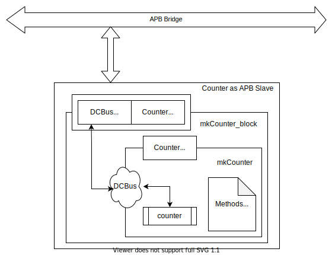

# Device Configuration Bus [DCBus] - A Quick Overview
 This library is a modified version of the CBus library provided by Bluespec.
### Assumptions:
 1. all configuration registers start at an address boundary of 4-bytes.
 2. Address width is at least 4 bits 
 3. Data width of registers can only be one of: 8, 16, 32, 64 
### Features:
 1. The configuration registers can each be of any length (max of 4)
 2. Ability to control the size of operation to be performed on each register using *AccessSize & mask*
 3. can connect to a bus of any size: 8, 16, 32 or 64 independent of the widths of the register 
 4. Provided read-write, read-only, write-only and write-sideeffect register types

# Guide (For Developers)

Monad --> ModuleCollect --> CBus --> DCBus

[Checkout the Bluespec Reference guide](http://csg.csail.mit.edu/6.375/6_375_2016_www/resources/bsv-reference-guide.pdf) along with this help

## Monad & Monadic Operations 

- A term in functional programming and typeclass in BSV
- allows abstract representation for structure program with auto-generating 'base' code. (a.k.a boilerplate code)
- combines computation, forming complex computations
- State monad: attach state information to the existing type and outputs new state ( used in modulecollect)
- [C.3.12](http://csg.csail.mit.edu/6.375/6_375_2016_www/resources/bsv-reference-guide.pdf) Situations that are considered as monadic. Actionvalue & module instantiation.
- Takeaway: mapCollection

## Modulecollect (c.10.2)
- Variation to the 'Module' type of BSV
- 'Additional interfaces' added to the existing design with seperation of 'additional design details' from the 'main design details'.
- A module accumulating a collection must have the '[]' after the keyword 'module' - an instantiation of this module loses polymorphic capability and is constrained by 'inner module'
- For synthesis, accumulating collection should use 'exposeCollection' for top-level Module
- Three main operations on collection: add, expose & Mapping
- Takeaway: Operations of  Modulecollects 

## CBus (c.10.3)
- uses modulecollect to collect interfaces of CS Registers.
- CBusItem - type of item to be collected
- ModWithCBus - type of module collecting CBusItems (specify with [] after 'module')
- cbus_ifc - CBus Interface with write and read.
- IWithCBus - interface combines the cbus_ifc with actual (normal) module interface.
- collectCBusIFC - Add cbus to collection
> 			input : IWithCBus
> 			output: actual (normal) interface

- exposeCBusIFC  - exposes the collected cbus with a new interface.
> 			input : ModWithCBus
> 			output: IWithCBus

- Module primitives:
 	- mkCBRegR 	 - Readonly CBUS interface to the collection
 	- mkCBRegRW	 - Read/Write CBUS interface to the collection
 	- mkCBRegW 	 - Writeonly CBUS interface to the collection
 	- mkCBRegRC    - Read/Clear CBUS interface to the collection
 	- mkCBRegFile  - normal RegFile interface

## DCBus
- Extension of Cbus with support for slave interface - (APB/AXI4L) bus based protocol

- Read :
> 		Input - Address, AccessSize
> 		Output - Data + bool flag

- Write:
>    	Input - address, data, strobe
>     	Output - bool Flag

- IWithSlave   - interface combines the slave_ifc with device_ifc
- collectCBusIFC - Add DCBus to collection
> 		Input : IWithDCBus
> 		Output: actual (normal) interface

- exposeCBusIFC  - exposes the collected DCBus with a new interface.
>		Input : ModWithDCBus
> 		Output: IWithDCBus

- DCRAddr       - structure with addr, mask & (min-max) allowedsize (8,16,32 & 64)
- DCBusItem   - type of items to be collected
- ModWithDCBus - type of module collecting DCBusItems (specify with [ ] after 'module')
- dc2apb          - takes IWithDCBus and returns Slave interface of APB 
- dc2axi4l        - takes IWithDCBus and returns Slave Interface of AXI4L
- Module primitives:
 	- mkDCBRegRO 	  - Regular Readonly DCBUS interface to the collection
 	- mkDCBRegRW	- Regular  Read/Write DCBUS interface to the collection
 	- mkCBRegWO 	 - Write only DCBUSregister  interface to the collection
 	- mkDCBRegROSe      - ReadOnly-Sideeffect DCBUS register interface to the collection
 	- mkDCBRegRWSe     - Read/Write-Sideeffect DCBUS register interface to the collection
 	- mkDCBRWireW       - Write only RWire with no implicit conditions
 	- mkDCBBypassWireROSe - ReadOnly-Sideeffect BypassWire
 	- mkDCBBypassWireRO     - Readonly BypassWire
 	- *CustomReg primitives with dcbus read & write can be defined at the peripheral.* 

## Example: [DCBCounter](./DCBusCounter.bsv)

A counter is designed with DCBus interface which is connected to APB bridge as peripheral using APB protocol. On a very high level abstract, the example can be represented as follows. 

mkCounter is an module that implements decrementing counter whose configuration register 'counter' is accessed using the DCBus. This register can be written in "privileged Secure" mode and read in any mode. Thus collected register is exposed via the new interface which is APB compatible.