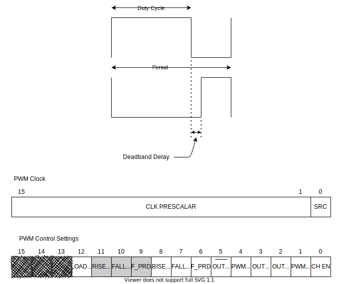

# PWM

This repo contains PWM peripheral device.  The Register details are as follows: 

| S.No |      Register      | Address |
| ---- | :----------------: | :-----: |
| 1.   |     PWM Clock      |   0x0   |
| 2.   |    PWM Control     |   0x4   |
| 3.   |     PWM period     |   0x8   |
| 4.   |   PWM duty cycle   |   0xC   |
| 5.   | PWM Deadband delay |  0x10   |

###### PWM Clock: 

- **SRC** :  External (0) / Internal (1) Clock
- **PRESCALAR**:  Clock value divisor

###### PWM Control Settings:

- **CH_EN:** Enable (1) / Disable (0) PWM Channel
- **PWM_ST:** Start (1) / Stop (0) Running PWM 
- **OUT_EN :** Enable(1) / Disable (0) Output of PWM
- ***OUT POL:*** Normal(1) / Inverted (0) polarity of Output 
- ***PWM_RST:*** Reset (1) the PWM counter = 0
- **COMP_OUT_EN:** Enable(1) / Disable (0) Complement Output of PWM
- **HF_PRD_INT_EN:** Enable(1) / Disable (0) Half period Interrupt( *Half Period /2*)
- **FALL_INT_EN:**  Enable(1) / Disable (0) Fall Interrupt  (*Duty cycle* **<** *Period* )
- **RISE_INT_EN:** Enable(1) / Disable (0) RISE Interrupt 
- **HF_PRD_INT**(***READ ONLY***): Half Period Interrupt Occurrence Indicator
- **FALL_INT** (***READ ONLY***): Fall Interrupt Occurrence  Indicator
- **RISE_INT** (***READ ONLY***): Fall Interrupt Occurrence  Indicator
- **LOAD_PWM**: Load the *duty cycle*, *period* and *deadband delay* values to PWM. This bit will be set back to (0) once the values are loaded. 

---
Note: 
1. For Zephyr PWM driver - `pwm_flags_t` is a 8-bit flag that holds `PWM_Control_reg[8:1]` 
