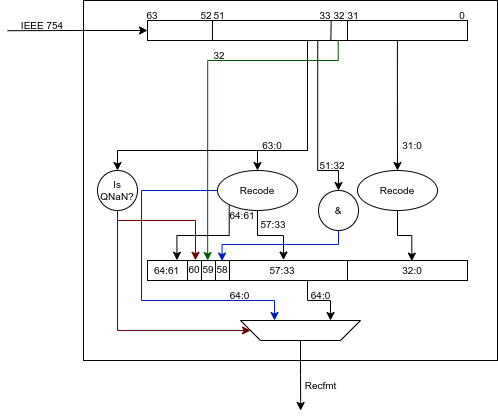

# Designing Floating point FPU for RISC-V using Recoded format for storage in internal register file

## Necessary Background information

Even though RISCV has support for multiple precisions of floating points(from half to quad).
For the sake of this discussion, we restrict ourselves to single and double precision floating point
operations. The same arguments and solutions can be extended to support other precisions if
necessary.

### RISCV
**NaN boxing** - The same register file is used for all the floating point operations regardless
of the precision. There exists a possibility that a register storing a single precision number is
used as a source operand for a double precision operation. This causes problems particularly in loads
and stores, where the software might have no knowledge of the precision of the value stored in the
register file(especially while performing context saving and restore). To mitigate this, whenever a
*n*-bit type value is present in a register and *n<flen*, the value is placed in the lower
significant *n* bits while the upper *flen-n* bits are filled with 1's. This is called *NaN boxing*
and results in a valid nan-boxed *n* bit value to appear as a negative qNaN when interpreted as a
*m* bit(*m>n*) value. In case the value is not correctly NaN boxed, the input to the operation is
the Canonical NaN.

**NaN Propagation** - In RISCV, the memory ops, sign injection and move ops do not canonicalise the
NaN values in the registers, i.e the NaN value in the input is propagated to the output. All other
operations produce the canonical NaN as the result whenever a NaN output is necessary.

### Recoded Format
Recoded format is a format which is used internally by the [HardFloat](http://www.jhauser.us/arithmetic/HardFloat-1/doc/HardFloat-Verilog.html) 
library from Berkeley. In this format, the exponent width is increased by 1 to enable treating the
subnormal numbers as regular floating point numbers. This causes the number of bits required to
increase by 1(i.e 33 bits for single precision). 

**Representation**:
|                   |      | standard format |             |      | HardFloat’s recoded format |                    |
|-------------------|:----:|:---------------:|:-----------:|:----:|:--------------------------:|:------------------:|
|                   | sign |     exponent    | significand | sign |          exponent          |     significand    |
| zeros             |   s  |        0        |      0      |   s  |         000xx...xx         |          0         |
| subnormal numbers |   s  |        0        |      F      |   s  |         2k + 2 − n         |    normalized F<\<n|
| normal numbers    |   s  |        E        |      F      |   s  |         E + 2k + 1         |          F         |
| infinities        |   s  |    1111...11    |      0      |   s  |         110xx...xx         |   xxxxxxx...xxxx   |
| NaNs              |   s  |    1111...11    |      F      |   s  |         111xx...xx         |          F         |

## Using Recoded format as primary storage representation

All the HardFloat modules convert inputs into the recoded format before performing any operation on them.
Storing them as Recoded format internally helps cut down on area and reduce the critical path of the
FPU. But this comes with multiple caveats. The values have to be converted into recoded format on a
load from memory or to the standard format for a store to memory. Since the latency of this
conversion module is high, an additional latency of 1 cycle will be incurred for the floating point
loads. The latency for the store can be subsumed in the execute stage as the values are readily
available(obtained from the decode stage) and independent. This raises the load to use latency for
the floating point operation to 3 instead of 2, as is for the integer operations.

For a double precision(*dp*) implementation the width of the registers will be 65 bits. While storing a
single precision(*sp*) value in the register will be performed according to the RISCV scheme. Note that
this does not cause problems while interpreting the values in the recoded format as it still appears
as a negative qNaN. However the problem arises when performing a context save-restore sequence. Let
the register `fx1` contain a *sp* floating point number. The software performs `fsd` 
operations to store the contents of the register into the memory(at time *x*) oblivious to whether 
a single or double precision value is present. When we convert the value in `fx1` from recoded to 
standard, the lower most 33 bits will contain the recoded representation of the 32 bit *sp* value. 
However in an implementation which stores in the IEEE format(and according to the RISCV spec), 
the lower 32 bits will be accurate. This will not cause any problems for the operations which use
this value in the program order after restoring context, due to
the NaN propagation in the `fld` instruction(say at a later time *y*). The anomaly is in the value
stored in the memory and will cause problems if the software switches to using a softfloat
implementation afterwards and uses that value for performing operations. The following snippet shows
the difference in values for a *sp* representation of `51.43`.

|                                              |                     |
|:--------------------------------------------:|:-------------------:|
|               SP representation              |      0x424db851     |
|            Recoded representation            |      0x82cdb851     |
|        Value in register fx1  (at t\<x)       | 0x1fffffffe82cdb851 |
|       Value stored into mem[a] (at t=x)      |  0xfffffffe82cdb851 |
| Value loaded into fx1 from mem[a] (at x\<t=y) | 0x1e00ffffe82cdb851 |
|     Actual value to be written to mem[a]     |  0xffffffff424db851 |

### Solution

In RISCV, whenever the output of an operation is NaN, it is the Canonical Nan, except for a few
conversion instructions which propagate NaN values. To address the problem explained above, while
loading values from memory, if the loaded value is a QNaN, the lower 32 bits are recoded
independently and placed in the lower 33 bits of the recoded *dp* value. The reverse is done while
converting from recoded to IEEE format i.e if the *dp* store/mv is a QNaN, the lower 33 bits are
independently converted into *sp* IEEE and then placed in the lower 32 bits of the IEEE *dp* value.
This however introduces a 1 bit error in certain cases as explained below.

### NaN boxed Recoded Values

In case of a QNaN in a higher precision format, there is a possiblity that the lower bits might hold
a valid floating number at a lower precision. For the purpose of this discussion we shall consider
double precision(64) as the highest supported width and single precision(32) as the lowest supported width.
This section can easily be extended to other formats via induction.

While recoding a ieee *dp* number, one can easily detect if its a QNaN and recode the lower 32 bits
independently as a sp number before replacing the lower 33 bits of the recoded dp number. 
While converting back to ieee the same process can be employed, but bit at index 32 actually 
encodes the sign of the sp number. This causes an error of 1 bit(bit at index 32). 
This is because each recoding needs 1 extra bit to store all the information. In this case  we 
perform 2 recodings and store the result into a 65 bit field. Hence the information about bit 32 
is lost. This does not affect any arithmetic operations in any way, but the NaN payloads are not
preserved. To prevent this, while recoding incase a number is interpreted as a QNaN, 
the dont care bits in the exp(bit at index 59) are reused to store bit 32. The same bit is placed 
into its original position while converting back to ieee. Similarly to speedup computations and
reduce logic overheads, bit 60 in a recoded NaN indicates whether the number is a QNaN and bit 58
indicates whether the number is a valid NaN boxed value. In RISC-V, a NaN which is non-canonical can
come into the system only as a result of a SP op or FMV/FL\* operations. In all of these cases, the
recoding functions takes care to encode the correct values into the respective bit positions and any
instructions which operate on these values either preseve NaN payloads or canonicalise the values,
thereby ensuring that the encodings are correct always. The following figure explains the process of
conversion from IEEE to recoded. 

